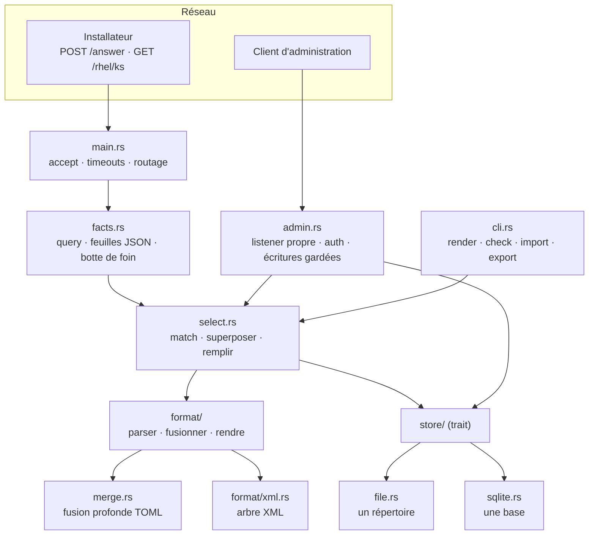

# Architecture

Un processus, une crate, aucun framework. `main.rs` est un binaire mince par-dessus `lib.rs`,
pour que chaque comportement soit testable directement plutôt qu'à travers une socket.

## La forme de l'ensemble



## Ce que possède chaque pièce

| Module | Possède |
|---|---|
| `main.rs` | le runtime tokio, la boucle d'accept, le sémaphore de connexions, les deux timeouts, le routage, la vérification du jeton de réponse, et l'appel `spawn_blocking` qui fait la recherche |
| `facts.rs` | transformer une requête en valeurs étiquetées — paramètres de query, corps JSON aplati, segments de chemin, et la botte de foin normalisée |
| `select.rs` | **le comportement qui compte** : normalisation, scoring, chaîne de groupes, ordre de fusion, remplissage de templates, et le listing mis en cache |
| `format/` | une interface par format de document. `Doc` parse, fusionne, rend, et signale ses clés de contrôle |
| `merge.rs` | la fusion profonde TOML, utilisée par `format` |
| `store/` | d'où viennent les documents, derrière un trait de lecture à deux méthodes |
| `admin.rs` | son propre listener, l'auth bearer, le garde-fou d'échecs, et l'annulation qui empêche une écriture de casser le jeu de réponses |
| `config.rs` | l'environnement, et la validation qui transforme une configuration dangereuse en erreur de démarrage |
| `envfile.rs` | le fichier que nomme `RESCRIPTUM_ENV_FILE` : parsé, jamais découvert, et fatal s'il est illisible |
| `cli.rs` | `render`, `check`, `import`, `export` |
| `capture.rs` | l'enregistrement des corps de requête |
| `log.rs` | une ligne par événement, des horodatages UTC calculés sans crate de date, et les deux réglages au-dessus : ce qui est gardé, et où cela va |

## La seule frontière qui mérite d'être défendue

**Le store est délibérément mince.** Il rend le texte brut des documents et un jeton de
version bon marché, et ne décide de rien :

```rust
pub trait Store: Send + Sync {
    fn version(&self) -> Version;               // assez peu cher pour être appelé par requête
    fn snapshot(&self) -> io::Result<Snapshot>; // seulement quand la version a bougé
    fn describe(&self) -> String;
}
```

Chaque décision — correspondance, chaînes `extends`, fusion, rendu, `check` — vit *au-dessus*,
dans `select.rs` et `merge.rs`, et est partagée par les deux backends. **Dès qu'un backend se
met à décider du comportement, les deux divergent.**

`tests/stores.rs` est ce qui fait de cela une garantie plutôt qu'une intention : chaque cas de
comportement tourne deux fois, une par store, et affirme le résultat identique.

La moitié écriture est un trait séparé, parce que servir des réponses n'en a jamais besoin :

```rust
pub trait StoreWrite: Store {
    fn put_machine(&self, id: &str, format: &str, body: &str) -> io::Result<()>;
    fn delete_machine(&self, id: &str, format: &str) -> io::Result<bool>;
    // …groupes, défaut
}
```

Notez que **chaque opération nomme un format**. Un document est indexé par *ce à quoi il
sert* — une machine *et* un système d'exploitation — pas par identifiant seul.

## La couche de cache

`Answers` enveloppe un store et garde un `Listing` parsé et fusionné derrière un mutex :

```rust
struct Cached { version: Version, loaded_at: Instant, listing: Arc<Listing> }
```

Une requête réutilise le cache seulement quand **les trois** conditions tiennent :

1. `store.version()` est inchangée — pour les fichiers, le mtime du répertoire ; pour SQLite,
   un atomique en mémoire ;
2. cette version est `Some` — une version illisible n'est jamais traitée comme « inchangée » ;
3. moins de `RELOAD_BACKSTOP` (1 s) s'est écoulé.

Le filet n'est pas redondant avec la vérification de version. **Éditer le *contenu* d'un
fichier de groupe ne bouge aucun mtime de répertoire**, et un changement fait par un autre
processus ne bouge aucun atomique en mémoire. Sans le filet, l'une ou l'autre édition serait
invisible jusqu'à ce qu'autre chose arrive au répertoire.

Un mutex empoisonné — une autre requête a paniqué en plein rafraîchissement — est récupéré
plutôt que propagé. Les données en cache sont encore structurellement saines, et faire échouer
une installation à cause du panic d'une autre requête serait le mauvais compromis.

## Pourquoi il n'y a pas de framework

Le routage ici est **un seul `if` sur la méthode et le chemin**. Un framework n'apporte rien
pour ça, et axum en particulier ne donne aucun moyen de définir un délai de lecture des
en-têtes — précisément le garde-fou anti-slowloris qui a motivé le passage à l'asynchrone.
Donc : hyper directement.

## Dépendances

64 crates, 2,4 Mo statique sur ARMv7 (1,3 Mo sans SQLite). Directes :

| Crate | Pour |
|---|---|
| `tokio` | le runtime, les timers, les signaux |
| `hyper` + `hyper-util` + `http-body-util` | HTTP/1, avec un délai de lecture des en-têtes |
| `toml_edit` | TOML, en préservant la mise en forme |
| `serde_json` | documents JSON, et aplatissement d'un corps de requête |
| `serde_yaml_ng` | documents YAML |
| `quick-xml` | documents XML |
| `rusqlite` (optionnelle, `bundled`) | le store SQLite |

**Aucun `serde` derive nulle part.** La règle d'origine était « ne jamais parser le corps de
requête comme du JSON » ; elle a été assouplie délibérément, et l'énoncé honnête de l'état
actuel est : le corps est parsé en une `serde_json::Value` **non typée** *quand il se trouve
être du JSON*, uniquement pour en récolter des faits. Rien n'est désérialisé dans une struct,
donc aucune hypothèse sur le schéma de Proxmox n'est gravée dans un type. Un corps qui n'est
pas du JSON n'est pas une erreur — il apporte la botte de foin et rien de plus. Voir
[sélection](./selection.md#lécart-avec-la-règle-dorigine).

Ajouter une dépendance exige une raison dans le message de commit. Ce binaire tourne en root
sur le matériel d'autres gens.
