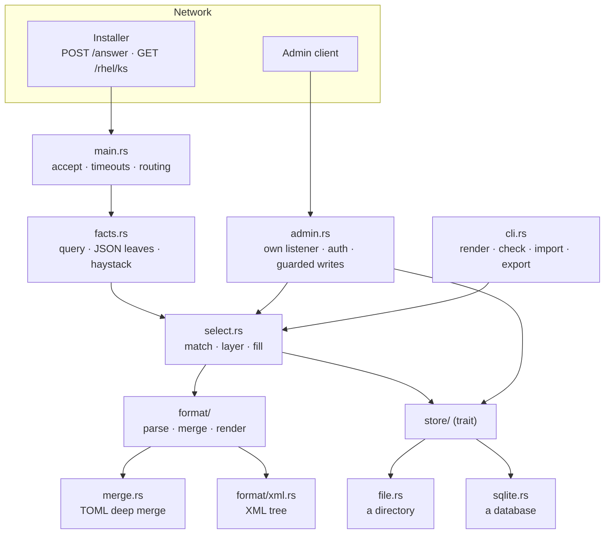

# Architecture

One process, one crate, no framework. `main.rs` is a thin binary over `lib.rs`, so every
behaviour can be tested directly rather than only through a socket.

## The shape of it



## What each piece owns

| Module | Owns |
|---|---|
| `main.rs` | the tokio runtime, the accept loop, the connection semaphore, both timeouts, routing, the answer-token check, and the `spawn_blocking` call that does the lookup |
| `facts.rs` | turning a request into labelled values — query parameters, a flattened JSON body, path segments, and the normalized haystack |
| `select.rs` | **the behaviour that matters**: normalization, scoring, the group chain, the merge order, template filling, and the cached listing |
| `format/` | one interface per document format. `Doc` parses, merges, renders, and reports its control keys |
| `merge.rs` | the TOML deep merge, used by `format` |
| `store/` | where documents come from, behind a two-method read trait |
| `admin.rs` | its own listener, bearer auth, the failure guard, and the rollback that keeps a write from breaking the answer set |
| `config.rs` | the environment, and the validation that turns a dangerous configuration into a startup error |
| `envfile.rs` | the file `RESCRIPTUM_ENV_FILE` names: parsed, never discovered, and fatal when it cannot be read |
| `cli.rs` | `render`, `check`, `import`, `export` |
| `capture.rs` | recording request bodies |
| `log.rs` | one line per event, UTC timestamps computed without a date crate, and the two knobs over both: what is kept, and where it goes |

## The one boundary worth defending

**The store is deliberately thin.** It hands back raw document text and a cheap version
token, and decides nothing:

```rust
pub trait Store: Send + Sync {
    fn version(&self) -> Version;              // cheap enough to call per request
    fn snapshot(&self) -> io::Result<Snapshot>; // only when version moved
    fn describe(&self) -> String;
}
```

Every decision — matching, `extends` chains, merging, rendering, `check` — lives *above*
it, in `select.rs` and `merge.rs`, and is shared by both backends. **The moment a backend
starts deciding behaviour, the two drift.**

`tests/stores.rs` is what makes that a guarantee rather than an intention: every
behavioural case runs twice, once per store, and asserts the identical outcome.

The write half is a separate trait, because serving answers never needs it:

```rust
pub trait StoreWrite: Store {
    fn put_machine(&self, id: &str, format: &str, body: &str) -> io::Result<()>;
    fn delete_machine(&self, id: &str, format: &str) -> io::Result<bool>;
    // …groups, default
}
```

Note that **every operation names a format**. A document is keyed by *what it is for* —
a machine *and* an operating system — not by identifier alone.

## The caching layer

`Answers` wraps a store and holds a parsed, merged `Listing` behind a mutex:

```rust
struct Cached { version: Version, loaded_at: Instant, listing: Arc<Listing> }
```

A request reuses the cache only when **all three** hold:

1. `store.version()` is unchanged — for files, the directory's mtime; for SQLite, an
   in-process atomic;
2. that version is `Some` — an unreadable version is never treated as "unchanged";
3. less than `RELOAD_BACKSTOP` (1 s) has passed.

The backstop is not redundant with the version check. **Editing a group file's contents
moves no directory mtime**, and a change made by another process moves no in-process
atomic. Without the backstop, either edit would be invisible until something else
happened to the directory.

A poisoned mutex — some other request panicked mid-refresh — is recovered into rather than
propagated. The cached data is still structurally fine, and failing an install over
another request's panic would be the wrong trade.

## Why there is no framework

Routing here is **one `if` on method and path**. A framework buys nothing for that, and
axum specifically gives no way to set a header-read timeout — which is precisely the
slowloris guard that motivated going async in the first place. So: hyper directly.

## Dependencies

64 crates, 2.4 MB static on ARMv7 (1.3 MB without SQLite). Direct:

| Crate | For |
|---|---|
| `tokio` | the runtime, timers, signals |
| `hyper` + `hyper-util` + `http-body-util` | HTTP/1, with a header-read timeout |
| `toml_edit` | TOML, preserving formatting |
| `serde_json` | JSON documents, and flattening a request body |
| `serde_yaml_ng` | YAML documents |
| `quick-xml` | XML documents |
| `rusqlite` (optional, `bundled`) | the SQLite store |

**No `serde` derive anywhere.** The original rule was "never parse the request body as
JSON"; it has since been relaxed deliberately, and the honest statement of where it stands
is: the body is parsed into an **untyped** `serde_json::Value` *when it happens to be
JSON*, purely to harvest facts. Nothing is deserialized into a struct, so no assumption
about Proxmox's schema is baked into a type. A body that is not JSON is not an error — it
contributes the haystack and nothing more. See [selection](./selection.md#the-departure-from-do-not-parse-the-json).

Adding a dependency needs a reason in the commit message. This binary runs as root on
other people's hardware.
