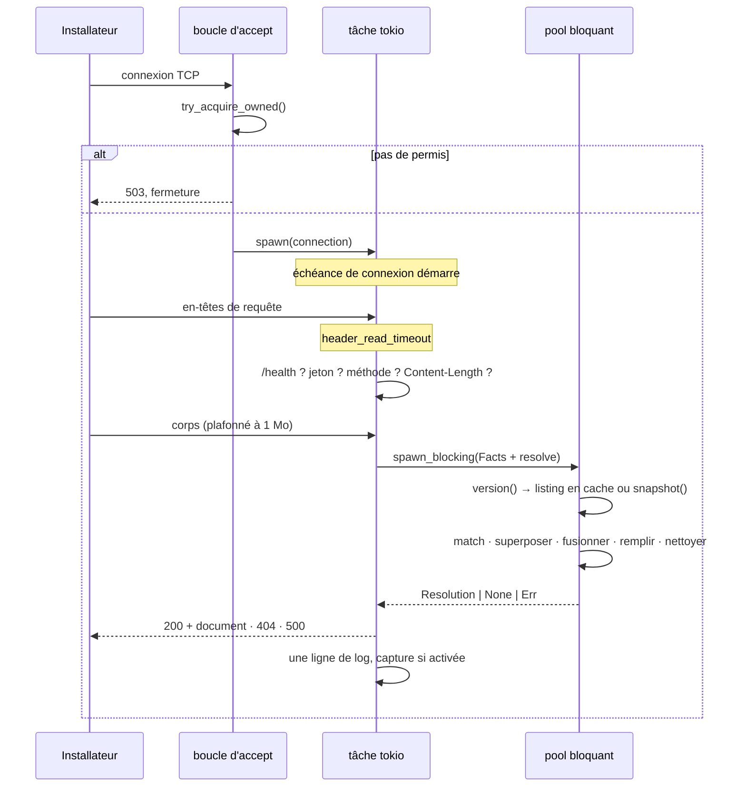

# Le cycle de vie d'une requête



## 1. Accept

`serve()` boucle sur `listener.accept()` dans un `tokio::select!` avec le signal d'arrêt
(SIGTERM, ce qu'envoie le planificateur de tâches DSM, ou Ctrl-C).

Un échec d'accept — épuisement de descripteurs de fichiers, par exemple — journalise et
**continue**. Terminer la boucle transformerait un problème de ressources passager en panne.

Un permis est pris au sémaphore avant le spawn. Sans permis, `shed()` écrit un `503` et ferme
— [répondre honnêtement plutôt que jeter en silence](./constraints.md#concurrence-bornée-même-si-les-tâches-sont-bon-marché),
pour que le client sache qu'il doit réessayer au lieu de deviner.

## 2. La connexion

Deux timeouts, et **aucun n'est redondant** :

| Garde-fou | Couvre |
|---|---|
| `http1::Builder::header_read_timeout` | un client qui ouvre une connexion et distille ses en-têtes |
| `tokio::time::timeout` autour de la connexion entière | tout ce qui vient après les en-têtes |

hyper n'a pas de délai de lecture de corps. Sans le second garde-fou, un client qui promet un
corps dans son `Content-Length` puis n'envoie rien garerait une connexion indéfiniment — à
l'intérieur d'un permis, donc en coûtant une place autant que de la mémoire.

> **hyper panique si un timeout est défini sans timer.** `header_read_timeout` exige
> `.timer(TokioTimer::new())`. Omettez-le et **chaque** connexion panique à l'exécution — cela
> ne casse pas la compilation. Voir [pièges](./traps.md).

## 3. Routage

Un seul `if` sur la méthode et le chemin, dans cet ordre :

1. **`GET /health`** → `200 OK`. Avant l'authentification, avant tout, pour que la supervision
   ne s'éteigne jamais.
2. **Le jeton de réponse**, quand `RESCRIPTUM_ANSWER_TOKEN` est défini. Comparé sans retour
   anticipé, pour qu'un mauvais jeton ne puisse pas être récupéré octet par octet par qui
   chronomètre les réponses. Journalisé, jamais limité en débit.
3. **La méthode** — tout ce qui n'est ni `GET` ni `POST` donne `405`.
4. **`Content-Length`** — une taille annoncée aberrante est refusée **depuis l'en-tête**,
   plutôt qu'en laissant `Limited` sauter après avoir tamponné un mégaoctet.
5. **Le corps**, via `Limited::new(…, MAX_BODY)`. Une erreur de limite de longueur devient
   `413`, toute autre `400`.

Il n'y a pas de routage de chemin au-delà : `POST` et `GET` sont traités sur **n'importe
quel** chemin, parce que l'URL est gravée dans une ISO. Le chemin n'est pas ignoré — il devient
des [faits](./selection.md) — il ne décide simplement pas s'il faut répondre.

## 4. Résolution, hors du worker asynchrone

```rust
let picked = tokio::task::spawn_blocking(move || {
    let facts = Facts::from_request(Some(&request_path), query.as_deref(), &body);
    answers.resolve(&facts)
}).await;
```

Les deux moitiés ont leur place hors du worker asynchrone : construire les faits est du
**travail CPU sur une charge de taille arbitraire**, et la recherche est de l'**E/S
bloquante**. Faire l'un ou l'autre sur un thread du runtime bloque toutes les autres
connexions que ce thread pilote.

À l'intérieur, `resolve()` :

1. demande au store sa `version()` — un `stat` pour les fichiers, une lecture atomique pour
   SQLite ;
2. réutilise le `Listing` en cache, ou prend un nouveau `snapshot()` et le reconstruit ;
3. choisit le meilleur document machine et le meilleur groupe ([scoring](./selection.md#scoring)) ;
4. résout `extends`, à l'intérieur d'un format ;
5. fusionne chaîne de groupes → document machine ;
6. remplit les `{{ placeholders }}` ;
7. retire les clés de contrôle ;
8. rend.

## 5. Réponse

| Résultat | Réponse |
|---|---|
| `Ok(Ok(Some(resolution)))` | `200`, le document, `Content-Type` selon son format, `Connection: close` |
| `Ok(Ok(None))` | `404 no answer file applies` |
| `Ok(Err(e))` | `500`, avec la raison sur la ligne de log |
| `Err(join_error)` | `500 answer lookup panicked` — cela ne peut pas emporter le serveur, mais ne doit pas non plus passer en silence |

Puis exactement une ligne de log, et une [capture](../guide/operations/capture.md) s'il y en a
une de configurée. Le corps a été cloné avant que la résolution ne le prenne, et seulement
quand la capture est active.

## Le listener d'administration

Un `TcpListener` séparé, une tâche `serve()` séparée, lancée seulement quand
`RESCRIPTUM_ADMIN_ADDR` est défini — et seulement après que `Config::validate` a confirmé que
le store est SQLite et que le jeton est assez long. Son propre pipeline est dans
[les internes de l'API d'administration](./admin.md).

## Arrêt

`SIGTERM` ou Ctrl-C termine la boucle d'accept et fait retourner `serve()`. Les connexions en
vol ne sont pas drainées : il n'y a pas d'état à perdre, le client réessaie, et un serveur de
provisioning qui refuse de s'arrêter est pire qu'un qui perd une requête.
