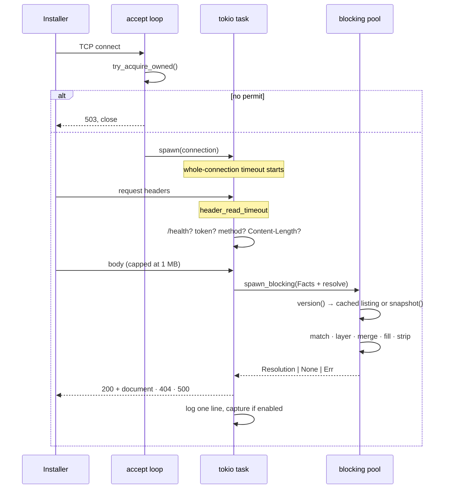

# The request lifecycle



## 1. Accept

`serve()` loops on `listener.accept()` inside a `tokio::select!` with the shutdown signal
(SIGTERM, which DSM's task scheduler sends, or Ctrl-C).

An accept failure — file-descriptor exhaustion, say — logs and **continues**. Ending the
loop there would turn a transient resource problem into an outage.

A permit is taken from the semaphore before spawning. Without one, `shed()` writes a
`503` and closes — [answering honestly rather than dropping silently](./constraints.md#bounded-concurrency-even-though-tasks-are-cheap),
so the client knows to retry rather than guessing.

## 2. The connection

Two timeouts, and **neither is redundant**:

| Guard | Covers |
|---|---|
| `http1::Builder::header_read_timeout` | a client that opens a connection and dribbles headers |
| `tokio::time::timeout` around the whole connection | everything after the headers |

hyper has no body-read timeout. Without the second guard, a client that promises a body in
its `Content-Length` and then sends nothing would park a connection indefinitely — inside
a permit, so it costs a slot as well as memory.

> **hyper panics if a timeout is set without a timer.** `header_read_timeout` requires
> `.timer(TokioTimer::new())`. Omit it and every connection panics at runtime — it does
> not fail to compile. See [traps](./traps.md).

## 3. Routing

One `if` on method and path, in this order:

1. **`GET /health`** → `200 OK`. Before authentication, before anything, so monitoring
   never goes dark.
2. **The answer token**, when `RESCRIPTUM_ANSWER_TOKEN` is set. Compared without an early
   return, so a wrong token cannot be recovered a byte at a time by whoever is timing the
   responses. Logged, never rate-limited.
3. **Method** — anything but `GET` or `POST` is `405`.
4. **`Content-Length`** — an aberrant declared size is refused **from the header**, rather
   than by letting `Limited` trip after buffering a megabyte.
5. **The body**, through `Limited::new(…, MAX_BODY)`. A length-limit error becomes `413`,
   anything else `400`.

There is no path routing beyond that: `POST` and `GET` are answered on **any** path,
because the URL is baked into an ISO. The path is not ignored — it becomes
[facts](./selection.md) — it just does not decide whether to answer.

## 4. Resolution, off the async worker

```rust
let picked = tokio::task::spawn_blocking(move || {
    let facts = Facts::from_request(Some(&request_path), query.as_deref(), &body);
    answers.resolve(&facts)
}).await;
```

Both halves belong off the async worker: building facts is **CPU work on an
arbitrary-sized payload**, and the lookup is **blocking IO**. Doing either on a runtime
thread stalls every other connection that thread is driving.

Inside, `resolve()`:

1. asks the store for its `version()` — one `stat` for files, an atomic load for SQLite;
2. reuses the cached `Listing`, or takes a fresh `snapshot()` and rebuilds it;
3. picks the best machine document and the best group ([scoring](./selection.md#scoring));
4. resolves `extends`, within one format;
5. merges group chain → machine document;
6. fills `{{ placeholders }}`;
7. strips the control keys;
8. renders.

## 5. Response

| Outcome | Response |
|---|---|
| `Ok(Ok(Some(resolution)))` | `200`, the document, `Content-Type` from its format, `Connection: close` |
| `Ok(Ok(None))` | `404 no answer file applies` |
| `Ok(Err(e))` | `500`, with the reason on the log line |
| `Err(join_error)` | `500 answer lookup panicked` — it cannot take the server with it, but it must not pass silently either |

Then exactly one log line, and a [capture](../guide/operations/capture.md) if one is
configured. The body was cloned before resolution took it, and only when capturing is on.

## The admin listener

A separate `TcpListener`, a separate `serve()` task, spawned only when
`RESCRIPTUM_ADMIN_ADDR` is set — and only after `Config::validate` has confirmed the store
is SQLite and the token is long enough. Its own pipeline is in
[the admin API internals](./admin.md).

## Shutdown

`SIGTERM` or Ctrl-C ends the accept loop and returns from `serve()`. In-flight connections
are not drained: there is no state to lose, the client retries, and a provisioning server
that refuses to stop is worse than one that drops a request.
