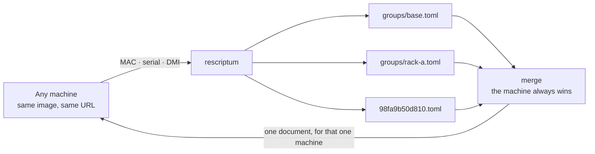

# rescriptum

*An HTTP server that compiles and renders the configuration files for automated OS
installs.*

**Provision a fleet without writing a file per machine — one config, and only the
differences.** It answers any unattended installer: Proxmox, Debian, RHEL, Ubuntu, Flatcar,
SUSE, Windows. It recognises the machine from its MAC address, serial number or hardware
inventory, stacks the layers that apply to it, and returns the result. Whatever a machine is
about to receive, you can read it before you power the machine on.



Every machine boots the same image and asks the same server, so the address inside the image
cannot be what tells them apart. What tells them apart is what they say when they ask — and
installers ask in one of two shapes, both answered here, on any path:

- **They POST what they found.** Proxmox VE, since 8.2, sends a JSON inventory — NICs and
  their MAC addresses, disks, DMI — and expects the answer file in the response body. This is
  why a static file server cannot do this job: the reply depends on the request.
- **They GET with their identity in the query string.** Kickstart, preseed, Ubuntu
  autoinstall, Ignition, AutoYaST: iPXE substitutes the MAC or the serial into the URL before
  fetching it.

```console
$ RESCRIPTUM_ANSWERS_DIR=/srv/answers rescriptum
2026-08-24T08:43:36Z - rescriptum 0.1.0 listening on 0.0.0.0:8000 — store=files:/srv/answers workers=8 max_conn=2048 timeout=10s
2026-08-24T08:43:37Z 10.0.0.42:51234 POST /answer body=1876 200 format=toml machine=98fa9b50d810 group=rack-a bytes=431
```

One static binary, no runtime, no container — as happy on a 512 MB ARM NAS as on a
datacenter host fielding a provisioning burst.

## Thirty seconds

```console
$ mkdir -p answers/groups
$ cat > answers/groups/rack-a.toml <<'TOML'
members = ["98:fa:9b:50:d8:10", "98:fa:9b:50:d8:11"]

[global]
keyboard = "fr"
timezone = "Europe/Paris"

[disk-setup]
filesystem = "zfs"
zfs.raid   = "raid1"
TOML

$ RESCRIPTUM_ANSWERS_DIR=answers rescriptum render 98:fa:9b:50:d8:10
# format=toml group=rack-a
[global]
keyboard = "fr"
timezone = "Europe/Paris"
…
```

That is one rack **as Proxmox**. The same directory holds `groups/rack-a.ks` for the RHEL
nodes and `groups/rack-a.preseed` for the Debian ones — same idea, different extension. A
document is keyed by *(machine, format)*, so one machine can be several operating systems at
once and the URL picks between them.

Then point whatever you are installing at **its own URL** — one server answers them all:

| Installing | Point it at | Serves |
|---|---|---|
| Proxmox VE | `--url http://SERVER:8000/proxmox/answer` | `.toml` |
| RHEL · CentOS · Fedora · Alma · Rocky | `inst.ks=http://SERVER:8000/rhel/ks?mac=${net0/mac}` | `.ks` |
| Debian | `url=http://SERVER:8000/debian/preseed?mac=${net0/mac}` | `.preseed` |
| Ubuntu | `ds=nocloud-net;s=http://SERVER:8000/ubuntu/?mac=${net0/mac}` | `.yaml` |
| Flatcar · Fedora CoreOS | `ignition.config.url=http://SERVER:8000/flatcar/config` | `.ign` |
| openSUSE · SLES | `autoyast=http://SERVER:8000/suse/profile` | `.autoyast` |
| Windows | your own tooling, from `http://SERVER:8000/windows/unattend` | `.unattend` |
| anything line-oriented | `http://SERVER:8000/cfg/…`, `/ipxe/…` | `.cfg`, `.ipxe` |

## Start here

- **[What rescriptum is](./guide/index.md)** — the problem it solves and the shape of the
  solution, in five minutes.
- **[Install](./guide/install.md)** then **[serve your first answer](./guide/quickstart.md)** —
  from a downloaded binary to a machine receiving its own configuration.
- **[Preparing installer media](./guide/iso.md)** — the URL to bake into each ISO, per
  operating system.

## Writing answers

- **[How an answer is picked](./guide/answers/selection.md)** — by name, by member list, or
  by what the machine *is*.
- **[One document per operating system](./guide/answers/formats.md)** — the extension is the
  format, the endpoint chooses between them.
- **[Groups and merging](./guide/answers/grouping.md)** — a rack shares one file; a machine
  that differs carries only its difference.
- **[Templating](./guide/answers/templating.md)** — `{{ serial }}` in a group covers five
  hundred machines.
- **[Validating what will be served](./guide/answers/validating.md)** — `render` and `check`,
  because a merged answer is a document nobody ever wrote.

## Running it

- **[Deployment](./guide/operations/deployment.md)** and
  **[Synology DSM 7](./guide/operations/synology.md)**.
- **[Security](./guide/operations/security.md)** — what the tokens protect and what they do
  not.
- **[The SQLite store](./guide/operations/sqlite.md)** and
  **[the admin API](./guide/operations/admin-api.md)** — for a fleet administered by tooling
  rather than by hand.
- **[Troubleshooting](./guide/operations/troubleshooting.md)** — the log line is the whole
  diagnostic story.

Exhaustive tables live in the [Reference](./guide/reference/index.md): every
[environment variable](./guide/reference/configuration.md), the
[HTTP surface](./guide/reference/endpoints.md), the
[format and alias tables](./guide/reference/formats.md), and the
[command line](./guide/reference/cli.md).

## Working on rescriptum

The [Development](./development/index.md) space is the other half of this site: the
[constraints](./development/constraints.md) that shape the code and why they are not
negotiable, the [lifecycle of a request](./development/request-lifecycle.md), the internals
of [selection](./development/selection.md), [formats](./development/formats.md) and
[stores](./development/stores.md), how the [tests](./development/testing.md) are organised,
and how a [release](./development/releasing.md) is cut.
